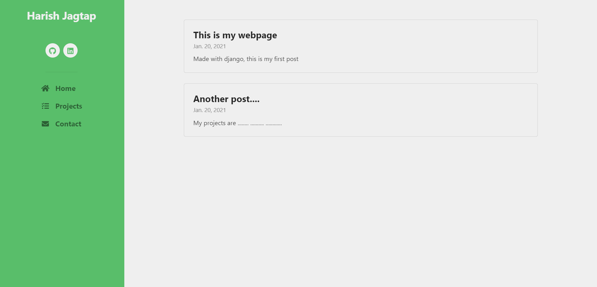
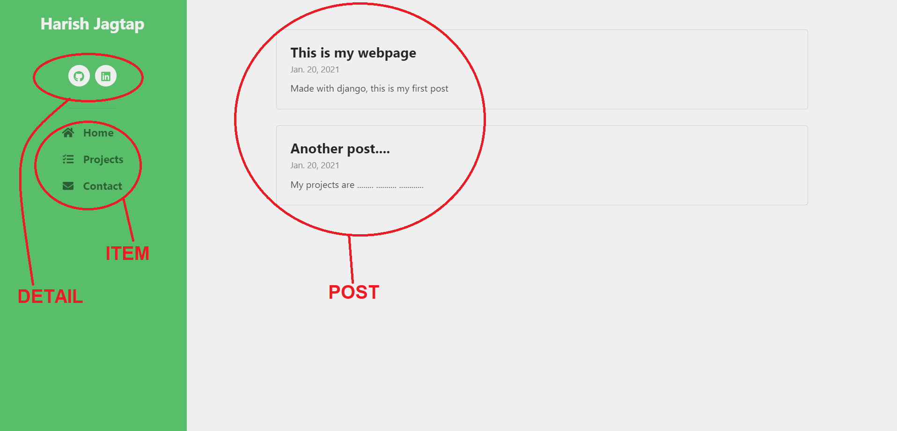

## Setup Python Virtual Environment
`python -m virtualenv . -p python3` 
`start Scripts\activate` 
`pip install -r requirements.txt`   

## Setup Django and start Server
Enter these commands from the Virtual Environment  
`cd mywebsite`  
`set SECRET_KEY="---Your Secret Key Here---"`  
`python manage.py collectstatic`  
`python manage.py makemigrations`  
`python manage.py migrate --run-syncdb`  
`python manage.py createsuperuser`  
`python manage.py runserver`   

## Setup Webpage and customize
Go to admin page ("127.0.0.1:8000/admin/") and add "Item" (Title=Home, link=home)  
The webpage requires "Home" item as bare minimum to run.  

To add Social profile links, go to admin page and add "Detail".  
To add Subpages, go to admin page and add "Item".  
To add Posts in any Subpage, go to admin page and add "Post".  
This creates your custom webpage.  

Now, you can continue to add posts and modify the webpage without getting into html/css.  
`Note: The body of the posts support html, and require html tags like   for newline, etc.`  

The webpage is mobile-responsive.  
I have only created the Django part of this project, the html/css were taken from a template.   

